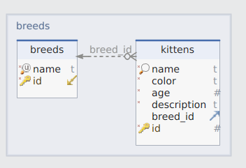
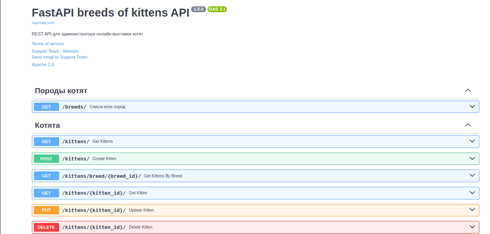

# Kittens API
## Описание проекта
### Схема базы данных



### Стартовая конфигурация системы
Перед запуском приложения либо тестов убедитесь в наличии в
директории с проектом файла `.env`, хранящего следующие настройки:

* **MODE** = DEV
  > режим запуска приложения (TEST - тестовый; DEV - основной)
* **DB_HOST** = db
  > адрес расположения базы данных
* **DB_PORT** = 5432
  > порт, на котором работает база данных
* **DB_USER** = postgres
  > пользователь базы данных
* **DB_PASS** = postgres
  > пароль для базы данных
* **DB_NAME** = app_db
  > название базы данных
---
* **TEST_DB_HOST** = test_db
  > адрес расположения тестовой базы данных
* **TEST_DB_PORT** = 5432
  > порт, на котором работает тестовая база данных
* **TEST_DB_USER** = postgres
  > пользователь тестовой базы данных
* **TEST_DB_PASS** = postgres
  > пароль для тестовой базы данных
* **TEST_DB_NAME** = test_app_db
  > название тестовой базы данных


## Установка и запуск

Скопируйте репозиторий используя следующую команду:

```bash
git clone https://github.com/YuryRass/FastAPIKittenExhibition.git
```

Затем перейдите в каталог с проектом:

```bash
cd FastAPIKittenExhibition
```

В корне проекта переименуйте конфигурационный файлы `.env-example` на `.env`

На операционной системе Linux переименовать файл можно следующей командой:

```bash
mv .env.example .env
```

### Основной запуск проекта

Для основного запуска проекта введите команду:


```bash
docker compose up -d --build
```

```P.S. При этом значение переменной окружения MODE в файле .env должно быть равно DEV```

После запуска приложения можно перейти по ссылке: http://0.0.0.0:8000/docs и увидеть все API ручки:



### Запуск проекта с прохождением тестов

Тестовые сценарии расположены в каталоге `tests`

Для запуска проекта с прохождением тестов через pytest необходимо переменной **MODE** присвоить значение `TEST`.

После этого необходимо подготовить оболочку с соответсвующими зависимостями:
```bash
python3 -m venv venv
source venv/bin/activate
pip install -r requirements.txt
```
и выполнить следующую команду:
```bash
pytest tests
```

## Контакты

**telegram** [@YurySundown](https://t.me/YurySundown)

**e-mail** <yurchik1997yurchik@gmail.com>
